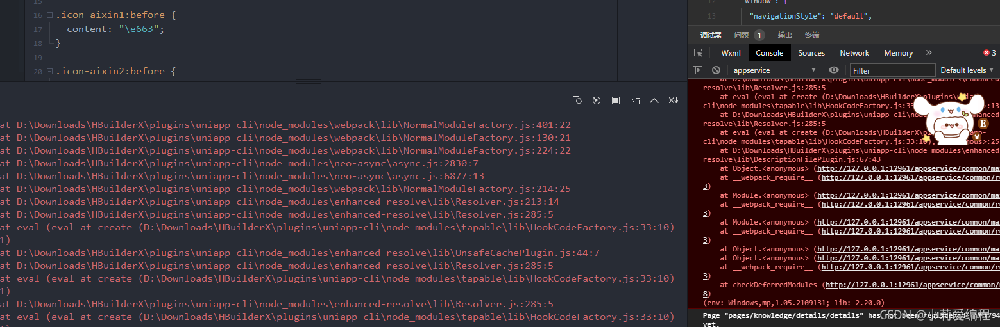
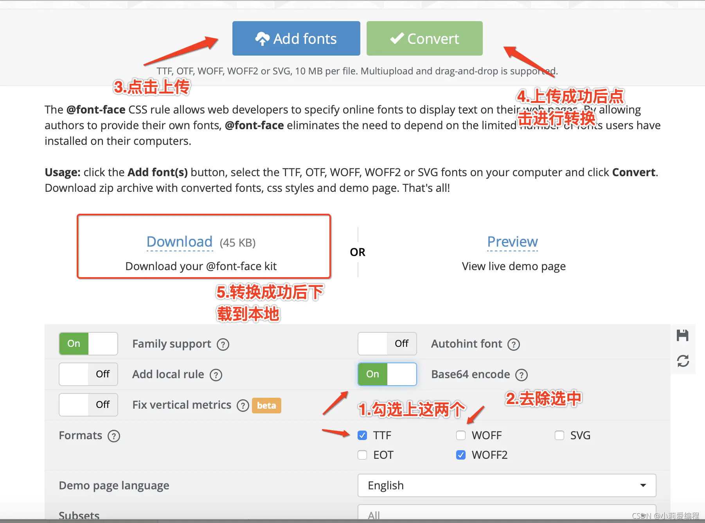
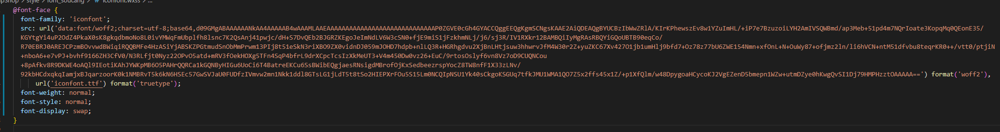

<strong style="color:red;font-size:30px;text-align: center;">小程序学习</strong>

## 1.vscode增加easy less

使用easy less插件实现小程序对less的支持，需要在set.json里配置

```json
"less.compile": {
    "compress": true, // 是否删除多余空白字符
    "sourceMap": false, // 是否创建文件目录树，true的话会自动生成一个 .css.map 文件
    "out": true, // 是否编译输出文件
    "outExt": ".wxss", // 输出文件的后缀,默认为.css
}
```

## 2.wxss导入样式

``` wxss
@import '相对地址'
```

## 3.小程序页面给方法传参及input组件输入值获取

### 3.1双向绑定

`model:需要绑定的参数`例如：`model:value`或`model:checked`等。

### 3.2通过点击方法给js传参

#### a.给触发方法传参

点击方法传参小程序必须是通过自定义数据的方式`data-参数名`，如果参数名中间有大写字母需要在两中间通过`-`连接。例如：`data-change-value`

```html
<button class="btn" bindtap="changeNumber" data-change-value="{{1}}">+</button>
```

小程序获取方法函数传参

```js
//方法函数传参获取
changeNumber(e){
    console.log(e.currentTarget.dataset.changeValue);
}
```

#### b.input输入数据后端js获取

页面在输入数据时通过`bindinput`绑定输入触发事件

## 4.小程序rpx与px之间如何运算

```js
1px = 1rpx / 750 * wx.getSystemInfoSync().windowWidth;
```

如果需要在wxss里动态使用rpx与px之间的算法就需要使用calc()方法，calc在使用时需要在运算符前后留有空格例如

```css
.texts{
    border:2px solid black;
    width: calc(750rpx * 100 /375 );
}
//100px等于多少rpx
100px=750rpx * 100 /375
```

## 5.通过id获取小程序相关内容

```js
//创建微信事件
var query = wx.createSelectorQuery();
var that=this;
//id绑定
query.select('#tt0').boundingClientRect();
//事件处理
query.exec(function(e){
    console.log(e)
    that.setData({
        //通过屏幕宽度wx.getSystemInfoSync().windowWidth计算便宜量
        swidth:(wx.getSystemInfoSync().windowWidth-parseInt(e[0].width))/2
    })
})
```

## 6.vscode多行选择

```shel
SHift+Alt+鼠标拖动选中
```

## 7.子组件事件不是写入定义data同级方法需要写入到methods方法内

```js
methods:{
    dianjifangfa(e){}
}
```


## 7.父组件给子组件传值

父页面通过变量给子组件传值

```js
<gao aa="11"></gao>
```

子组件通过properties里定义接受信息

```js
properties:{
    //要接受的数据的名称
    aa:{
        type:string,	//要接收数据的类型
        value:''		//默认值    
    }
}
```

子组件使用数据时跟data内定义的参数一样使用。

```js
<view>{{aa}}</view>
```

## 8.子组件给父页面传值

 在子组件点击事件里通过triggerEvent调用父页面自定义事件

```js
//this.triggerEvent('父组件自定义方法名'，'参数')
this.triggEvent('itemChange',{index})
```

父页面自定义方法

```js
<gao bindItemChange="handleItemChange"></gao>
```
## 9.小程序导入iconfont库报错


从iconfont库下载代码，转到字体转换网站将字体转换成base64格式的
[转换网站](https://transfonter.org/)[</a>](https://transfonter.org/)

将下载下来的css里的信息拷贝到wxss里


